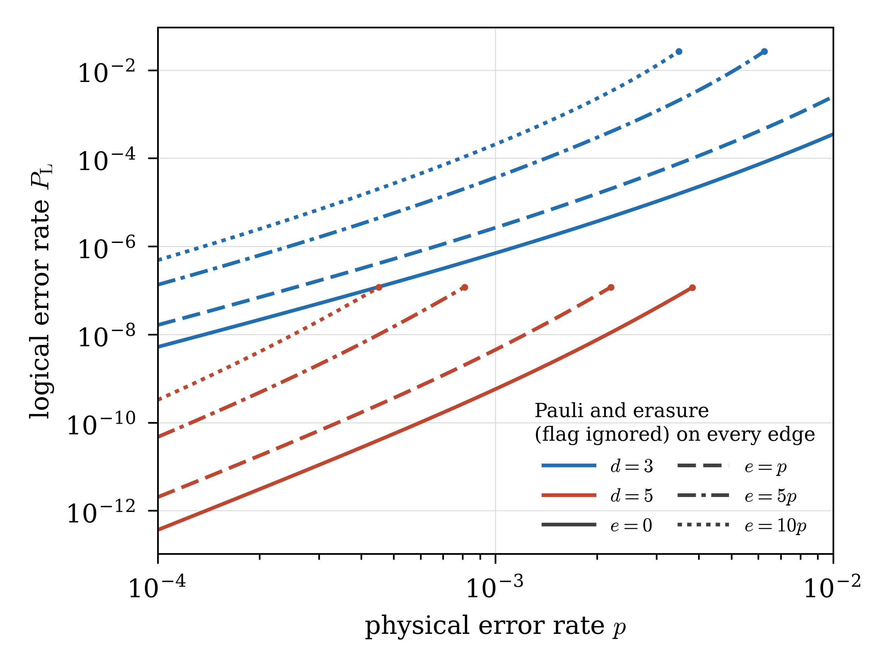

# Exact logical error rates with noise on ZX edges

This folder computes the logical error rate of the SOFT cultivation circuits when the noise sits on the edges of
their ZX diagrams instead of at the circuit-level locations of the source files. It is an addition to the companion
code of [Exact logical error rates for magic state cultivation](https://arxiv.org/abs/2609.18922). The results here
are not in that paper.

Every edge of the diagram carries its own Pauli channel, and optionally an erasure whose flag is either ignored or
used to reject the shot. As in the paper, the output is

    A(p) = Pr(every detector passes),   B(p) = Pr(every detector passes and the observable is flipped),
    P_L  = B / A,

as exact series in x = p/(1-p) with rational coefficients. Nothing is sampled. The circuits are those of
[`../data/inputs`](../data/inputs), and the calculation reuses the repository's tensors, native kernels and growth
tree in place.

## Result

P_L = sum_k L_k x^k with x = p/(1-p). Each coefficient is exact.

| Circuit | Noise on every ZX edge | Locations | Leading terms of P_L | P_L at p = 10^-3 |
|---|---|---:|---|---:|
| d=3 | Pauli, X, Y, Z with p/3 each | 285 | (1/2) x^2 + (1753/9) x^3 + (186325/27) x^4 | 7.035e-7 |
| d=3 | the same and an erasure with p, flag ignored | 570 | (49/32) x^2 + (300797/288) x^3 + (902451581/13824) x^4 | 2.651e-6 |
| d=5 | Pauli, X, Y, Z with p/3 each | 1602 | (25/72) x^3 + (138125/864) x^4 + (1942148657/31104) x^5 | 5.744e-10 |
| d=5 | the same and an erasure with p, flag ignored | 3204 | (8575/4608) x^3 + (331858625/221184) x^4 + (32675757107399/31850496) x^5 | 4.488e-9 |
| d=3 | Pauli and an erasure with 5p, flag ignored | 570 | (361/32) x^2 + (6029441/288) x^3 + (50902332845/13824) x^4 | 3.661e-5 |
| d=3 | Pauli and an erasure with 10p, flag ignored | 570 | (289/8) x^2 + (1080673/9) x^3 + (33088366265/864) x^4 | 2.079e-4 |
| d=5 | Pauli and an erasure with 5p, flag ignored | 3204 | (171475/4608) x^3 + (18067192625/221184) x^4 + (4836967378339043/31850496) x^5 | not trusted |
| d=5 | Pauli and an erasure with 10p, flag ignored | 3204 | (122825/576) x^3 + (11592259625/13824) x^4 + (2778633113412049/995328) x^5 | not trusted |
| d=5 | circuit-level noise of the source file (paper) | 3564 | (574/375) x^3 + (972959741/810000) x^4 + (2678166036893/4860000) x^5 | 3.328e-9 |

The d=3 series run to x^10 and the d=5 series to x^7; the computed coefficients are in [`results`](results). The
d=5 rows with 5p and 10p follow from the d=5 Pauli series by the shift below, without a new calculation; at
p = 10^-3 their last term exceeds 1% of the sum, so the truncated series is not trusted there. For d=5 with a
Pauli on every edge,

    P_L = (25/72) x^3 + (138125/864) x^4 + (1942148657/31104) x^5 + (1014982213225/373248) x^6
          + (104127082016159/1119744) x^7 + O(x^8),

so the circuit still needs three faults to fail, as with circuit-level noise.

An ignored erasure replaces the edge by a random qubit, X, Y or Z with probability e/4 each: it depolarises the edge
completely. On every edge both channels then only damp the nontrivial labels, by (1 - 4p/3) and (1 - e), so with the
same channels on every edge A and B depend on (1 - 4p/3)(1 - e) alone and, exactly,

    P_L(p, e) = P_L^Pauli(p'),   p' = p + 3e/4 - p e.

Every saved erasure series (d=3 with e = p, 5p, 10p, d=5 with e = p) equals the shifted Pauli series coefficient by
coefficient (`tests/test_fast.py`). In particular the leading coefficient grows by (1 + 3e/(4p))^d. When the flag
rejects the shot instead, A and B gain the factor (1 - e) for every edge and P_L is the Pauli series.

## Figure

<p align="center">
  
</p>

P_L against p with a Pauli and an ignored erasure on every ZX edge. Each curve is the saved Pauli series at the
shifted rate p'; a curve stops (dot) where its last term reaches 1% of the sum. `figures/erasure_rates.py` draws it
from `results/` with matplotlib ([`../requirements-plots.txt`](../requirements-plots.txt)).

## The noise model

A ZX edge is a wire between two consecutive operations on a qubit, or the internal edge of a CNOT between its Z and X
spiders: X on it is X on the target, Z is Z on the control and Y both. (A CZ edge carries a Hadamard: X on it is Z on
the target.) A measurement ends its wire and a reset starts a new one. The edges stop where the noiseless tail of the
file begins, the code projection and logical readout; the edges into the tail are noisy. The d=3 file has 285 edges,
the d=5 file 1602.

A noise specification is a JSON file of rules applied in order (see [`specs`](specs)):

```json
{"model": "edges",
 "rules": [{"pauli": {"X": "1/3", "Y": "1/3", "Z": "1/3"}},
           {"select": {"kinds": ["cnot"]}, "pauli": {"X": "1/2", "Z": "1/2"}},
           {"select": {"lines": [140, 189]}, "noiseless": true},
           {"select": {"roles": ["wire"]}, "erasure": {"rate": "1/2", "rule": "ignore"}}]}
```

Rates are rational multiples of p. A rule selects edges by kind (wire, cnot, cz), role (wire, discard, into readout,
inside), source line range, qubit, name or index, and sets their Pauli rates, makes them noiseless, or adds an
erasure at rate e = rate * p with the rule `ignore` or `discard`. The model `source` keeps the noise instructions of
the file. `python -B -m zxedge.edges <circuit>` lists the edges with their names and lines.

Each location is one factor 1 + x (sum_f w_f [f] + (1 - sum_f w_f) [I]) of the label network, so that
A(p) = (1-p)^N A-hat(x) and B(p) = (1-p)^N B-hat(x), N the number of locations.

## Method

**Whole circuit (d=3).** The circuit and its locations become one Pauli-label network of the repository's tensors
([`../alternatives/calculation/chan.py`](../alternatives/calculation/chan.py)). It is reduced exactly (linear
elimination, fixed and diagonal indices, absorption, exact low-rank splits) and contracted along a
[cotengra](https://github.com/jcmgray/cotengra) plan. Every tensor holds the coefficients of x^0 .. x^K modulo a prime
below 2^21, so float64 matrix products are exact: products stay below 2^42 and their sums below 2^53.

**Three stages (d=5).** The whole d=5 network is far too wide. The calculation follows Appendix E of the paper:

1. the first stage (injection and the d=3 double check, source lines up to 188) is a network with open output labels
   on the seven d=3 data qubits, restricted to the 256 operators of the code's normaliser. Its Walsh transform is
   the paper's table W over the input syndrome and the logical tag. The tag form exists because the output has no
   Z_L part, which is checked at every prime;
2. growth (lines 189-387) is Clifford. Every Pauli fault in it gets its 75-bit label from the growth-instrument
   compiler that wrote [`../data/models/growth_frame_model.json`](../data/models/growth_frame_model.json); every
   edge channel fits a leaf of the repository's tree ([`../data/plan`](../data/plan), 569 leaves, eight Fourier
   characters), and a leaf table is the exact convolution of its channels;
3. the final stage (d=5 double check and noiseless readout, lines from 388) is a network with an open input label on
   the nineteen data qubits, 20 coefficients, giving the response table F.

The tree is then evaluated with polynomial entries by the repository's native kernels. The cut is exact for this
circuit: the stage conditions (the first-stage detectors, every growth record that is not a free random outcome,
the final detectors without earlier records) span the same 107-dimensional space as the declared detectors.

**Exact coefficients.** Each prime gives A-hat and B-hat modulo that prime. The coefficients follow by the Chinese
remainder theorem and rational reconstruction, and one further prime must agree. When no edge has a total fault rate
above p, every coefficient satisfies 0 <= B_k <= A_k <= C(N, k).

## Checks

- d=3 with the circuit-level noise of the source file gives the repository's d=3 series.
- d=5 with the circuit-level noise of the source file, through the three stages, gives the repository's d=5 A and B
  through x^7, every coefficient equal modulo the test prime (after the factor (1+x)^1568 for the identity locations
  the paper leaves out).
- For the 1207 growth channels of the source file the compiler gives the labels of `growth_frame_model.json`.
- The edge leaf tables equal a direct convolution of their channels.
- The 26 data wires that cross a stage cut, moved into the other stage, give the same A and B.

`tests/test_fast.py` and `verify.py` check these in seconds where no contraction is needed; `tests/test_slow.py`
contracts again.

## Reproduce

From this folder, with the packages of [`requirements.txt`](requirements.txt), a C++17 compiler for the d=5 route,
and one BLAS thread:

```sh
python3 -B verify.py                      # manifest, saved series rebuilt from their residues, fast tests
python3 -B verify.py --slow               # also the contracting checks, about 25 minutes

python3 -B -m zxedge.whole --circuit clifft_d3_p001.stim --noise specs/edges_uniform.json \
    --degree 10 --primes 8 --output results/d3_edges_uniform.json                     # about 1 minute
python3 -B -m zxedge.staged.run --noise specs/edges_uniform.json --degree 7 --primes 9 --workers 4 \
    --output results/d5_edges_uniform.json                                              # about 35 minutes
python3 -B -m zxedge.summary results/*.json
python3 -B figures/erasure_rates.py       # the figure, from the saved series
```

For d=5 a prime takes two to four minutes on four cores at x^7, depending on the plan found, after one planning of
about six minutes. Plans and compiled kernels go to `../outputs/zx_edge_noise/`.

## Limitations

- The whole-circuit route reads any stim or clifft circuit with R, RX, M, MX, MPP, CX, CZ, H, S, T and Pauli gates,
  as long as its network contracts, which holds at d=3 sizes. Raw ZX diagrams are not read.
- The three-stage route is written for the d=5 SOFT circuit: its cut lines, free growth records, code definitions and
  tree come from the repository. Another circuit needs its own cut and growth tree, and a noise model whose growth
  channels fit no leaf needs a new tree.
- With the same channels on every edge any (p, e) follows from the Pauli series by the shift above. For other mixes
  p and e are tied, e = rate * p; each coefficient of x^k is a polynomial of degree k in the rate, so a two-variable
  series follows from k+1 rates. When an edge's total fault rate exceeds p (rate above 4/3), its identity weight is
  negative and the coefficients obey |A[k]|, |B[k]| <= C(N, k) m^k instead of 0 <= B[k] <= A[k] <= C(N, k).
- Decoding is not used: a shot that fails a detector is rejected.

## Files

| Path | Content |
|---|---|
| `zxedge/circuit.py`, `edges.py`, `noise.py` | circuit reader, ZX edges, noise specifications |
| `zxedge/network.py`, `elimination.py`, `engine.py`, `splitter.py` | label networks and their exact contraction |
| `zxedge/series.py`, `whole.py`, `summary.py` | primes, reconstruction, the whole-circuit route, printing |
| `zxedge/staged/` | the three-stage d=5 route; `stabilizer/` holds the compiler's stabilizer-support helpers |
| `specs/` | noise specifications used for the results |
| `figures/` | the figure above and the script that draws it |
| `results/` | exact series with every residue they were rebuilt from |
| `tests/`, `verify.py`, `manifest.json` | checks |
